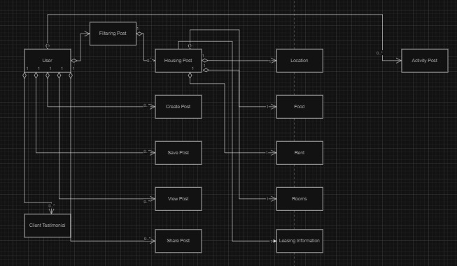
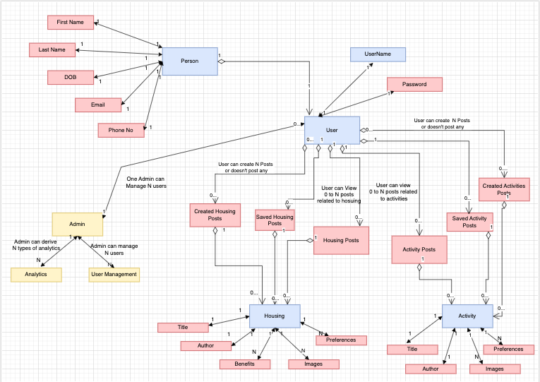

# OneSpot - Simplifying Housing and Social Experiences

## Rough Object Model

[]

## Detailed Object Model
[]

## Project Ideation and Rough Tracker
https://docs.google.com/spreadsheets/d/1tzB7FZyj7R98kTlTe5e8taOGFv37yzAjoJMWu7ZzVLI/edit#gid=0

## Mission

OneSpot aims to simplify and enhance the housing and social experiences for university students and young adults by providing a platform where users can easily find compatible housemates, post and discover various activities, and even verify housing options. We strive to save users time and effort, creating a sense of community and convenience.

## Vision

OneSpot envisions a future where students no longer struggle with the hassle of finding the right housemates or participating in enjoyable activities. Our platform will be the go-to solution for seamless housing arrangements and social interactions, fostering a sense of community and convenience.

# OneSpot - Simplifying Housing and Social Experiences

## Technology Stack Overview

OneSpot is developed using the MERN (MongoDB, Express, React, Node.js) stack, ensuring scalability, flexibility, and a rich user experience.

### Key Technologies

- **JSON Web Token (JWT):** Provides secure authentication and efficient transmission of user claims for personalized, protected interactions on OneSpot.

- **Redux Persist:** Enables seamless state persistence across sessions, preserving critical data and application states for uninterrupted user experiences.

- **Progressive Web Application (PWA):** Embraces PWA principles, delivering an immersive, responsive experience with offline functionality and rapid loading for a reliable user experience.

### Styling Libraries

Multiple styling libraries enhance the user interface:

- **Material-UI:** A popular React UI framework bringing a consistent design system and components to OneSpot.

- **Styled-components:** Empowers styled components with a flexible and dynamic styling approach for a unique and attractive UI.

- **Tailwind CSS:** Provides utility-first CSS for efficient styling and customization of UI elements.

### Image Storage

Firebase Cloud Storage is employed for storing and fetching images, ensuring efficient management of visual content on OneSpot.

### Additional Libraries

- **EmailJS:** Used for sending email notifications to users, enhancing communication and engagement.

- **Google Maps React:** Integrates Google Maps functionality to show the distance from the current location to Northeastern University, enhancing location-based features.

The OneSpot technology stack is carefully selected to deliver a cutting-edge, reliable, and delightful user experience.

## Screenshots

# HomePage

## Project Tracker Documentation
https://docs.google.com/spreadsheets/d/1tzB7FZyj7R98kTlTe5e8taOGFv37yzAjoJMWu7ZzVLI/edit#gid=0

## Identified APIs

1. **User Authentication API:**
   - Essential for user registration and login.

2. **Post Management API:**
   - CRUD operations for housing and activity posts.
   - Filter and search functionality based on various attributes.

3. **User Profile API:**
   - Enables users to create and manage their profiles, including setting preferences.

4. **Activity Creation API:**
   - Allows users to create activity posts, specifying details like the type of activity, time, location, and any requirements.

5. **User Filtering API:**
   - Allows users to filter and sort the list of housing and activity posts based on specific criteria.

6. **Admin Management API:**
   - Provides administrative functionalities, such as managing user accounts and handling reported posts.

7. **Recommendation API:**
   - Provides recommendations to users based on their preferences and interactions on the platform.

## Pages

### Landing Page

The landing page serves as the first point of contact for users. It includes information about OneSpot, a call-to-action for login to search for homes, and an explanation of how the platform works.

### Login / Sign Up

This page/modal facilitates user authentication. Users can log in using email and password, sign up using email or Google/SSO.

### Home Page for Users

The user homepage features a navbar with links to find housing and activities, trending content, and a dynamic section showcasing new housing and activity posts.

### Admin Homepage

A specialized homepage for administrators, providing access to controls and features tailored to administrative needs.

### View Housing Posts

This page displays a curated list of housing posts with filters for users to customize their search based on various criteria such as beds, bathrooms, dietary restrictions, and more.

### View Selected Housing Post

This page presents detailed information about a selected housing post, including images, a brief intro, author preferences, and options to show interest or save the post.

### Create Housing Post

Users can create a housing post by uploading images, providing post details, preferences, and perks.

### My Posts

A user-centric section where users can view all their previous posts, enabling easy management and updates.

### Saved Posts

A dedicated page showcasing saved housing and activity posts, providing users with a centralized view of their preferences and interactions.

### View Activities Posts

This page presents a curated list of activity posts with filters, allowing users to explore and engage in various activities.

### View Selected Activity Post

Detailed information about a selected activity post, including images, a brief intro, author preferences, and options to show interest or save the post.

### Create Activity Post

Users can create activity posts by uploading images and providing details about the activity, preferences, and any requirements.

### My Activities

Similar to the "My Posts" section, this page allows users to view and manage all their previous activity posts.

### Update Profile

A unified page for users and admins to update their profiles, ensuring accurate and up-to-date information.

### Physical Verification

A unique feature allowing users to earn by verifying houses before payments, enhancing trust and security.

## Team Members

- Mohit Bhagwanani (NUID: 002875368)
- Vishnu Paduchuri (NUID: 002292931)
- Piyush Pandey: (NUID: 002680284)
- Ajay Devmane: (NUID: 002879430)

## Milestones

### UI Design and Landing Page Implementation
- Design and implement the landing page's user interface.
- Develop UI for user authentication and sign up.
- Design the user interface for the homepage and admin homepage.
- Implement UI for creating posts, viewing housing posts, and managing posts.
- Implement UI for viewing and interacting with activities.

### Project Initiation and Planning
- Initiate the project by finalizing team members and the project idea.
- Conduct brainstorming sessions to derive key features.
- Create an initial object model to guide the project's structure.
- Identify REST APIs for different pages to plan the development process.

### Integration and Additional Features
- Identify and integrate third-party APIs if needed.
- Finalize REST APIs for remaining pages.
- Complete the implementation of the 'Save posts' feature in the middleware.
- Perform any necessary integration and testing for additional features.

### Documentation and MongoDB Setup
- Create OpenAPI specification .yaml files for API documentation.
- Set up MongoDB for data storage.
- Conduct self-learning sessions on the MERN (MongoDB, Express.js, React, Node.js) tech stack.
- Create a product requirement document and conduct market research.
- Perform testing and address bug fixes.

### Middleware Development
- Implement middleware for the landing page functionality.
- Develop middleware for user authentication and sign up.
- Implement backend logic for the homepage and admin homepage.
- Develop middleware for creating, viewing, and managing posts.
- Implement middleware for viewing and interacting with activities.
- Develop middleware for updating user profiles and handling physical verifications.

### Project Presentation 
https://northeastern-my.sharepoint.com/personal/paduchuri_v_northeastern_edu/_layouts/15/stream.aspx?id=%2Fpersonal%2Fpaduchuri%5Fv%5Fnortheastern%5Fedu%2FDocuments%2FRecordings%2FCall%20with%20Ajay%20and%202%20others%2D20231213%5F233433%2DMeeting%20Recording%2Emp4&ga=1&referrer=StreamWebApp%2EWeb&referrerScenario=AddressBarCopied%2Eview

https://northeastern-my.sharepoint.com/:v:/g/personal/paduchuri_v_northeastern_edu/EQEOuBwlhUZBiN5CljsaJxIBF0cvzpUSmuRVBkKW_RizZg?nav=eyJyZWZlcnJhbEluZm8iOnsicmVmZXJyYWxBcHAiOiJTdHJlYW1XZWJBcHAiLCJyZWZlcnJhbFZpZXciOiJTaGFyZURpYWxvZy1MaW5rIiwicmVmZXJyYWxBcHBQbGF0Zm9ybSI6IldlYiIsInJlZmVycmFsTW9kZSI6InZpZXcifX0%3D&e=BnGYFY

### Project Slides
https://www.canva.com/design/DAF26VxlToA/HntJzn7oJsYqs9cIqMbrLQ/edit
